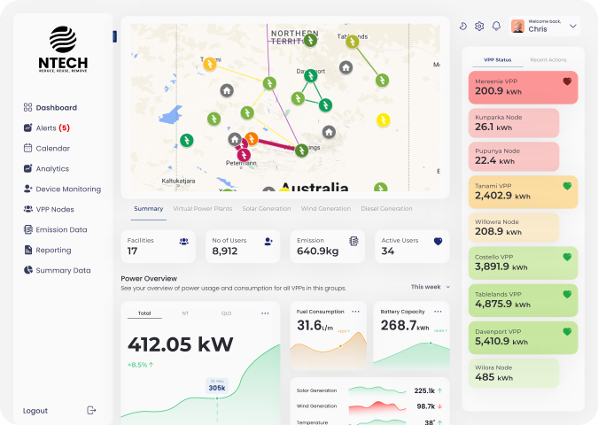

# NTech - GovHack 2022

| Project  | Details  |
| ------------ | ------------ |
|  Team | Sugarcity.io  |
|  Project |  NTech |
|  Hackerspace |  https://hackerspace.govhack.org/projects/ntech |
|  Website |  http://ntech.sugarcity.io |
|  Video | https://youtu.be/C6vaTo3gns8  |
|  Presentation |   |
|  Work Evidence | https://github.com/sugarcity-io/govhack22  |
|  Members | Chris Vella, Dennis Murphy, Todd Turner, Aiden Payne, Nathan Payne |

## Project Description

NTech

## Data Story

Various data sources were utilised to validate the proposed Virtual Power Plant (VPP) technology to be implemented within a remote Northern Territory community.

### Identifying Remote Northern Territory Communities
Identifying the communities which would be serviced via the Indigenous Essential Services (IES) was the first step. The Displacing Diesel project overview indicated that these remote communities are classified as Remote Australia or Very Remote Australia, by the Australian Bureau of Statistics (ABS). This information served as our as our starting point.

The ABS Data Explorer as a great start to identify communities which were classified as Remote Australia or Very Remote Australia by the ABS Statistical Geography Standard (ASGS) Remoteness Standard. Majority of the communities were identified, however not all could be, so were sourced from other sources from the internet to fill in the data gaps. The ABS Data Explorer was also utilised to estimate the approximate population of each one of these communities.

### Community Profile
The ABS Community Profiles dataset was extremely valuable to quickly establish a typical profile for a household that would reside in each one of the identified Northern Territory remote communities. This profile was required to help estimate the energy usage and peak demand requirements for a typical household, within the community. Many of these communities fell within the 0852, 0862 and 0872 postcodes; which made profiling the households within these communities relatively straightforward.

With a typical residential dwelling profiled, it was time to estimate the number of dwellings which resided in each one of these communities. This in-turn, would help estimate the number of potential Distributed Energy Resources (DER) that could be available to participate in the Virtual Power Plant (VPP) project.

### Validation of Proposed Technology
Solar irradiance levels and rainfall data was sourced from the Bureau of Meteorology (BOM) to confirm adequate levels of potential to validate the use of small-scale solar photovoltaic generators (SGUs) within the locations of the remote communities. With the primary energy source which the proposed VPP will consist of validated; our team also looked at the existing SGU installations across the Northern Territory, to help estimate an average installation capacity. Data from the postcode data for small-scale installations was utilised to calculate that the average installation capacity across the Northern Territory in the previous year was roughly 11kW. A conservative approach was taken, based on the typical dwelling profile obtained from the previous datasets, to downscale this average unit capacity down to 5kW.

With validation from the datasets completed, it was now easy to estimate the viability of the solution. The Renewable Energy Fractions (ERFs), initial capital costs and ongoing maintenance costs could now be approximated and compared via several scenarios of differing operational variables.
