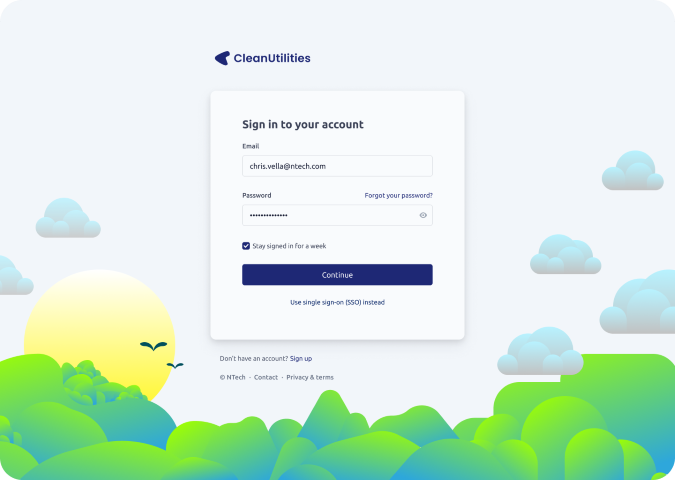
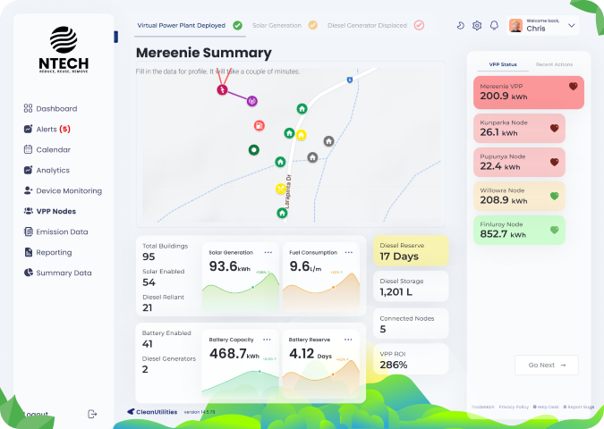
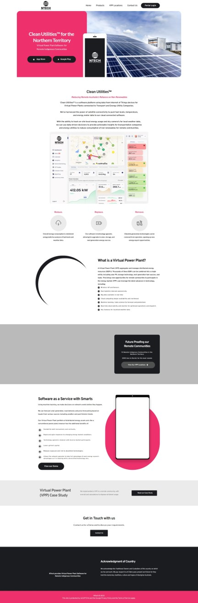

# Sugarcity.io - GovHack 2022

| Project  | Details  |
| ------------ | ------------ |
|  Team | Sugarcity.io  |
|  Project |  NTech |
|  Hackerspace |  https://hackerspace.govhack.org/projects/ntech |
|  Website |  http://ntech.sugarcity.io |
|  Video | https://youtu.be/C6vaTo3gns8  |
|  Presentation |  [CleanUtilities PowerPoint](docs/presentation.pptx) |
|  Work Evidence | https://github.com/sugarcity-io/govhack22  |
|  Members | Chris Vella, Dennis Murphy, Todd Turner, Aiden Payne, Nathan Payne |
|  Tags | #reduce #replace #remove #replace diesel #vpp #renewables #green energy #data driven |

## Project Description

### NTech - Clean Utilities for the Northern Territory

*Clean Utilities by NTech is a GovHack 2022 project for the Sugarcity.io team from Mackay, QLD.*

Clean Utilities™ by NTech is a Software-as-a-Service (SaaS) platform utilising data from Internet of Things (IoT) devices to integrate a Virtual Power Plant (VPP) system. Our smart solution unifies and connects scalable, renewable energy generation solutions, such as solar and wind, coupled with large-scale power production (diesel generators, grid power). By interconnecting small house and business based clean gneration and battery storage into a VPP network, Clean Utilities effectively displaces the need for inconvenient and costly fossil fuels.

Imagine having solar and battery storage on each individual house and networking these in a local grid that intelligently reports all information to a cloud platform. This is our Virtual Power Plant (VPP) solution, Clean Utilities. A VPP aggregates and manages distributed energy resources (DER's) allowing thousands of these DER's to be combined into a single entity; including solar PV, storage technology, next generation fuel sources, and loads. Even in isolated situations, such as floods where existing diesel deliveries cannot be made, our platform allows for ongoing power generation, storage, and usage.

Clean Utilities, our modern web application, connects to a range of IoT sensors, including:
- Power Monitoring
- Battery Monitoring
- Weather Monitoring
- Fuel Reserve Monitoring
- Solar Monitoring
- Sky Cameras
- And many more

The platform provides key insights, device and VPP monitoring, predictive analytics, health and heartbeat status of devices and nodes, and much more across a single pane of glass. Utilising advances in network communications, all of these IoT sensors can communicate back to the central cloud platform using Starlink and Sky Muster satellites, LTE-M, and NB-IoT, to allow for connectivity even from the most remote and disconnected locations in Australia.

Virtual Power Plants, due to being distributed in nature, diverse in energy source and operating via realtime data and analytics, do away with the need to curtail the output of renewable energy sources; ensuring maximum Renewable Energy Factors are achieved at all times. The diverse nature of VPP energy sources also ensures renewable energy is always present, even when the sun isn't shining. While the concept of a VPP is not new, the introduction of our new technologies in IoT sensors and network communications, along with advanced software solutions, has dramatically altered the viability of displacing diesel in remote areas and shifting to clean energy in all communities. 

#### Clean Utilities Sign In

#### Clean Utilities Dashboard

#### Clean Utilities Summary

#### NTech Website

## Data Story

Various data sources were utilised to validate the proposed Virtual Power Plant (VPP) technology to be implemented within a remote Northern Territory community.

### Identifying Remote Northern Territory Communities
Identifying the communities which would be serviced via the Indigenous Essential Services (IES) was the first step. The Displacing Diesel project overview indicated that these remote communities are classified as Remote Australia or Very Remote Australia, by the Australian Bureau of Statistics (ABS). This information served as our as our starting point.

The ABS Data Explorer as a great start to identify communities which were classified as Remote Australia or Very Remote Australia by the ABS Statistical Geography Standard (ASGS) Remoteness Standard. Majority of the communities were identified, however not all could be, so were sourced from other sources from the internet to fill in the data gaps. The ABS Data Explorer was also utilised to estimate the approximate population of each one of these communities.

### Community Profile
The ABS Community Profiles dataset was extremely valuable to quickly establish a typical profile for a household that would reside in each one of the identified Northern Territory remote communities. This profile was required to help estimate the energy usage and peak demand requirements for a typical household, within the community. Many of these communities fell within the 0852, 0862 and 0872 postcodes; which made profiling the households within these communities relatively straightforward.

With a typical residential dwelling profiled, it was time to estimate the number of dwellings which resided in each one of these communities. This in-turn, would help estimate the number of potential Distributed Energy Resources (DER) that could be available to participate in the Virtual Power Plant (VPP) project.

### Validation of Proposed Technology
Solar irradiance levels and rainfall data was sourced from the Bureau of Meteorology (BOM) to confirm adequate levels of potential to validate the use of small-scale solar photovoltaic generators (SGUs) within the locations of the remote communities. With the primary energy source which the proposed VPP will consist of validated; our team also looked at the existing SGU installations across the Northern Territory, to help estimate an average installation capacity. Data from the postcode data for small-scale installations was utilised to calculate that the average installation capacity across the Northern Territory in the previous year was roughly 11kW. A conservative approach was taken, based on the typical dwelling profile obtained from the previous datasets, to downscale this average unit capacity down to 5kW.

With validation from the datasets completed, it was now easy to estimate the viability of the solution. The Renewable Energy Fractions (ERFs), initial capital costs and ongoing maintenance costs could now be approximated and compared via several scenarios of differing operational variables.
